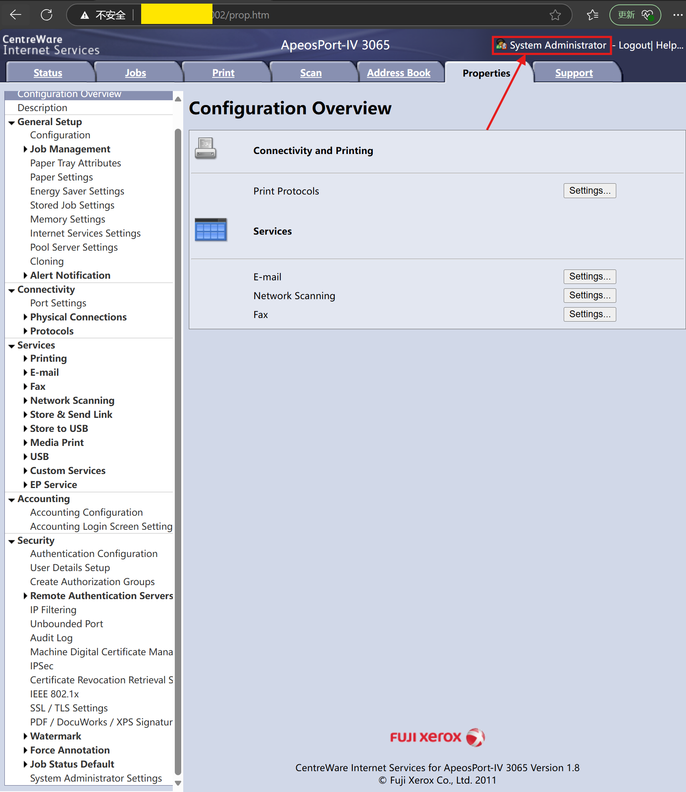
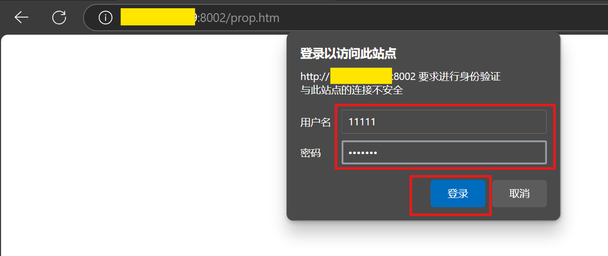
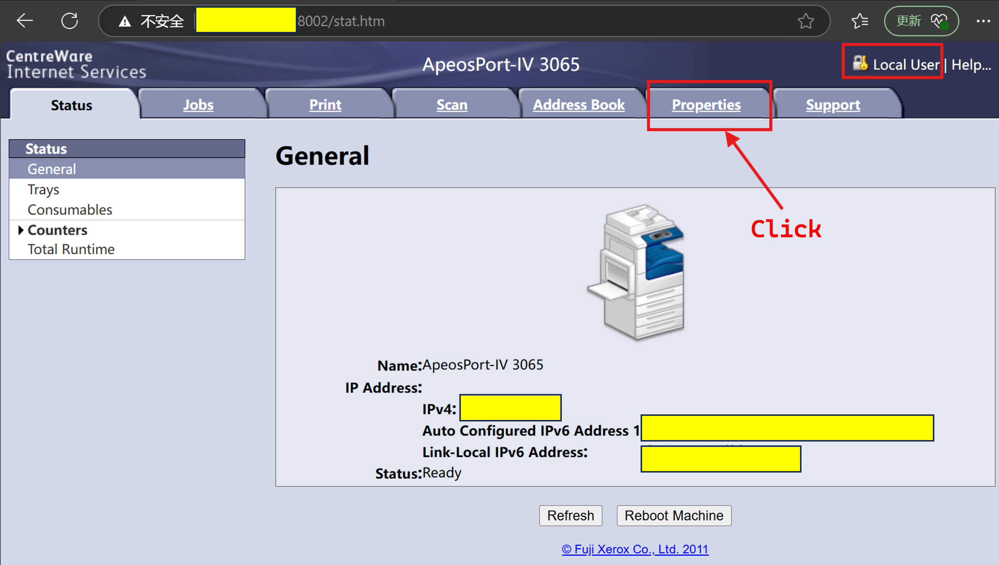

# Fuji Xerox ApeosPort-IV 3065 Default Administrator Credentials Allow Unauthenticated Remote Access (CWE-1392)
## Vulnerability Summary
A Fuji Xerox ApeosPort-IV 3065 printer running CentreWare Internet Services Version 1.8 has been found to contain a critical authentication vulnerability that corresponds to CWE-1392: Use of Default Credentials. The device ships with a commonly known default administrative credential set (username: 11111, password: x-admin) that remains active unless manually changed. This allows any unauthenticated attacker with network access to gain full administrative control over the device.
## Affected Device
Vendor: Fuji Xerox

Product: ApeosPort-IV 3065

Firmware Version: CentreWare Internet Services Version 1.8

## Vulnerability Details
The printer's web interface does not enforce any mandatory password change upon first use, nor does it disable the default administrative account (11111:x-admin). As a result, remote attackers can exploit this weakness to access privileged administrative functions, including but not limited to:

* Viewing or editing network configuration
* Accessing address book entries and user data
* Uploading print jobs
* Managing scan, email, and fax services
* Modifying security and authentication settings

This exposes sensitive information and may allow attackers to pivot into internal networks.

## Impact
An unauthenticated remote attacker can gain full administrative access to the printer without any prior knowledge of credentials. This can lead to:

* Information disclosure (e.g., internal contact emails, job logs)
* Unauthorized configuration changes
* Network infiltration and lateral movement
* Denial of service or sabotage through misconfiguration

## CWE Reference
CWE-1392: Use of Default Credentials

## Proof of Concept (PoC)
1. Open the device's web interface:
   http://xx.xx.xx.xx:8002/

2. Click the "Properties" tab, which prompts for authentication.

3. Enter the default credentials:
   - Username: `11111`
   - Password: `x-admin`

4. Upon successful login, the user is granted full administrative access.

5. Verify the access by viewing or modifying system settings such as:
   - Address Book
   - Network Scanning
   - E-mail and Fax Services
   - Port Settings and IP Filters

